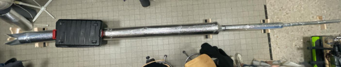

# Perforated Clay Brick for Air Cooling through Evaporation

## Project Overview



This Git repository contains the files and documentation for our 5ISS project: the creation of a test bench for the characterization of a cooling brick. 

### Contents of this repository:
- 📂 [**Application Code**](./CodeESPArduino) - The software running on our test bench.
- 📂 [**Virtual Environment Parameters**](./venv) - A folder containing the configuration for our virtual environment.
- 📄 [**Project Report**](./Report_Projet.pdf) - The complete documentation of our project.
- 📄 [**Materials and Costs**](./MaterialsDetails.md) - A file detailing the materials used and their prices.
- 📄 [**Use Case Scenarios**](./UsageScenarios.md) - A file describing the potential applications of the cooling brick.
- 📂 [**Images**](./Medias) - A folder containing all relevant project images.

---
## Prerequisites

Before you start, ensure you have the following installed on your machine:

- [Python](https://www.python.org/downloads/) (recommended version: 3.x)
- [pip](https://pip.pypa.io/en/stable/), the Python package manager
- [virtualenv](https://virtualenv.pypa.io/en/latest/) (optional but recommended for creating virtual environments)

## Installation

### 1. Unzip the Project

Download and unzip the project folder to your local machine.

### 2. Create and Activate a Virtual Environment

Open a terminal and navigate to the unzipped project folder. Then, run the following commands based on your operating system:

#### On Windows:

```bash
python -m venv venv
.\venv\Scripts\activate
```

#### On MAC/Linux:

```bash
python3 -m venv venv
source venv/bin/activate
```
### 3. Add QT Platform Variable (Optional for Specific Environments)
If you are working with a graphical user interface (GUI) library that requires Qt (e.g., PyQt or PySide) and encounter issues related to the display.
Follow these steps :

#### MAC/Linux

Open the activiation script
```bash
nano venv/bin/activate
```
Add the following line at the end of the file
```bash
export QT_QPA_PLATFORM=xcb
```

### 4. Install Dependencies
```bash
pip install -r requirements.txt
```
### 5. Running the Code
```bash
python main.py
```

## Usage 

Before anything else, to ensure everything works once the entire setup is in place according to the photos in the attached folder, you need to create a connection share or connect to a Wi‑Fi network by modifying the following two pieces of code: the two ESP codes. This is necessary to enter the connection sharing information so that all devices are on the same network, enabling MQTT communication.

You can modify them in the indicated sections of the various codes.

## Contributing

If you'd like to contribute to this project, please fork the repository, make your changes, and submit a pull request.


